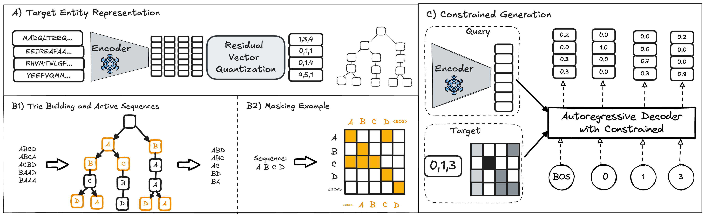

# BioCG: Constrained Generative Modeling for Biochemical Interaction Prediction


This repository contains the official PyTorch implementation for BioCG, as presented in our research paper.

## Abstract
We present BioCG, a constrained generative framework for predicting biochemical interactions, such as small molecule–protein binding and enzyme-catalyzed reactions. We pioneer a novel approach that transforms traditional classification-based biochemical interaction prediction into a sequence generation problem. BioCG harnesses the superior representational capacity of generative models while preventing overfitting through constrained sequence generation over a closed set of biochemical entities. Our approach employs an enhanced Residual Vector Quantization technique that creates unique discrete representations for target entities, combined with trie-guided decoding that guarantees valid outputs. We implement information-weighted training to handle varying complexity across generation steps, improving prediction accuracy with limited supervision data. In drug-target interaction prediction on BioSNAP, BioCG achieves 96.61% AUC, improving by 2.7% over previous SOTA. When predicting interactions with previously unseen proteins, BioCG reaches 89.31% AUC, a remarkable 14.3% improvement over SOTA. For enzyme function prediction on the CARE benchmark, BioCG achieves 70.48% top-1 accuracy, surpassing the previous best method by over 10%. By aligning generative capabilities with the inherently structured nature of biochemical output spaces, BioCG offers a robust solution for accurately predicting interactions even in scenarios where paired experimental data is scarce.


## Key Features

* **Novel Generative Formulation:** Reimagines biochemical interaction prediction as generating a valid target entity sequence given a query.
* **Guaranteed Validity:** Employs Residual Vector Quantization (RVQ) for unique discrete target representations and trie-guided decoding to ensure all generated outputs correspond to known, valid biochemical entities.
* **Enhanced Data Efficiency:** Achieves robust performance even with limited paired experimental data due to its constrained nature.
* **Superior Cold-Start Performance:** Excels at predicting interactions involving previously unseen entities (proteins or molecules).
* **Information-Weighted Training:** Optimizes the learning process by normalizing for varying decision complexity at different generation steps.
* **State-of-the-Art Results:** Demonstrates significant improvements over existing methods on DTI (BioSNAP) and enzyme function prediction (CARE) benchmarks.

## How BioCG Works

BioCG utilizes an encoder-decoder architecture tailored for constrained generation:

1.  **Query Entity Encoding:**
    * Input query entities (e.g., drugs as SMILES, proteins as FASTA sequences, reactions as SMILES) are fed into pre-trained, domain-specific encoders (e.g., ESM3 for proteins, MolFormer for molecules, RXNFP for reactions).
    * These encoders, managed by `pretrained_manager.py`, produce fixed-size vector representations. By default, these encoders are frozen during BioCG training to preserve their rich learned features, though they can be configured for fine-tuning.

2.  **Target Entity Discretization (RVQ):**
    * The set of all possible target entities for a given task (e.g., all proteins in BioSNAP, all EC numbers in CARE represented by proxy proteins) forms a closed, finite set.
    * These target entities are first converted into embeddings using their respective pre-trained models.
    * The `ResidualVectorQuantizer` class in `rvq.py` then applies a multi-stage k-means clustering process. It iteratively quantizes the residual embeddings from the previous stage until each target entity is represented by a unique sequence of discrete cluster centroid IDs. This creates a bijective mapping from each target entity to a unique code sequence.

3.  **Trie Construction for Constrained Decoding:**
    * A prefix tree (Trie) is constructed from all the unique discrete code sequences generated by RVQ. This is handled by the `Trie` class and `build_trie_from_text` function in `prefix_trie.py`.
    * This Trie structure stores all valid paths (i.e., valid target code sequences).

4.  **Constrained Autoregressive Generation:**
    * The encoded query vector serves as the initial context for a Transformer-based autoregressive decoder (specifically, `BertGenerationDecoder` from Hugging Face Transformers, configured in `main.py`).
    * The decoder generates the target's code sequence token by token.
    * **Crucially, at each generation step, the Trie is used to determine the set of valid next tokens.** The `build_mask_from_trie` function (in `prefix_trie.py`) creates a mask that is applied to the decoder's output logits, effectively pruning any generation paths that would lead to an invalid or non-existent target sequence. This ensures that only codes corresponding to entities in the predefined target set can be generated.
    * An optional information-weighted loss (controlled by the `entropy_normalize` config parameter) can be applied to account for the varying number of valid choices at different steps in the generation process.

5.  **Interaction Scoring:**
    * The raw output of the generative process is a sequence of codes. To get a final interaction score (e.g., for ranking or classification):
        * The simplest score can be derived from the generation probability of the target sequence.
        * For more robust scoring, especially in DTI, a lightweight meta-model (a small Transformer encoder, implemented in `logit_feature_transformer_pipeline.py`) is trained. This meta-model takes various features from the generative process (e.g., token probabilities, log-likelihoods, entropy at decision points) as input and predicts a final interaction probability.

The entire workflow, from data loading to training and evaluation, is orchestrated by `main.py`, driven by configuration files.


## File Structure

```
.
├── README.md
├── configs/
│   ├── biosnap_seen.yaml      # Example configuration for BioSNAP (seen setting)
│   └── care.yaml              # Example configuration for CARE benchmark
│   └── ...                    # Other .yaml configuration files for different experiments
├── data/
│   ├── biosnap.csv            # BioSNAP dataset file
│   └── care/                  # Directory for CARE benchmark data files
│       ├── test_enzyme.txt
│       ├── test_reaction.txt
│       ├── train_enzyme.txt
│       └── train_reaction.txt
├── logs/                      # Stores training logs (e.g., TensorBoard events, CSVs)
│   └── [experiment_name]/     # Subdirectories for each experiment's logs
├── results/                   # Stores model checkpoints and evaluation outputs
│   └── [experiment_name]/
│       └── checkpoint-xxxx/   # Saved model checkpoints
│       └── eval_logs.csv      # CSV log of evaluation metrics
├── rxnfp/                     # Local module for RXNFP (reaction fingerprinting)
│   ├── __init__.py
│   ├── data/                  # RXNFP model data (config, weights, vocab)
│   ├── main.py                # (Potentially RXNFP's own main script)
│   └── tokenizer.py           # RXNFP tokenizer
├── main.py                    # Main script to run experiments (training, evaluation)
├── rvq.py                     # ResidualVectorQuantizer class implementation
├── prefix_trie.py             # Trie data structure and helper functions
├── pretrained_manager.py      # Manages loading of various pre-trained models & tokenizers
├── data_manager.py            # Handles dataset loading, splitting, and PyTorch Dataset creation
├── utils.py                   # Utility functions (config loading, custom callbacks, etc.)
├── logit_feature_transformer_pipeline.py # Meta-model for DTI scoring
└── requirements.txt           # Python package dependencies
```

* **Core Logic:** `main.py`, `rvq.py`, `prefix_trie.py`, `pretrained_manager.py`, `data_manager.py`, `utils.py`, `logit_feature_transformer_pipeline.py`.
* **Experiment Configuration:** `configs/*.yaml` files define all parameters for an experiment.
* **Data:** Raw datasets are expected in the `data/` directory.
* **Outputs:** `logs/` for training metrics and `results/` for model checkpoints and detailed evaluation files.
* **RXNFP Dependency:** The `rxnfp/` directory contains the necessary components for using the RXNFP model for reaction encoding.

## Results Highlights

(Refer to Tables 2 & 3 in the paper for detailed metrics including Sensitivity and Specificity)

### Drug-Target Interaction (DTI) Prediction - BioSNAP Dataset

| Scenario         | BioCG (AUC) | Best Baseline (AUC) | Improvement |
| :--------------- | :---------- | :------------------ | :---------- |
| Seen             | **96.61%** | 93.91% (Top-DTI)    | +2.7%       |
| Unseen Protein   | **89.31%** | 75.01% (Top-DTI)    | +14.3%      |
| Unseen Molecule  | 91.21%      | 91.25% (Top-DTI)    | -0.04%      |
| _(vs DrugLAMP)_  | _91.21%_    | _89.06% (DrugLAMP)_ | _+2.15%_    |

### Enzyme Commission (EC) Number Prediction - CARE Benchmark

| Method    | Top-1 Accuracy |
| :-------- | :------------- |
| **BioCG** | **70.48%** |
| CREEP     | 60.3%          |

## Datasets

* **Drug-Target Interaction (DTI):**
    * **BioSNAP:** Located at `data/biosnap.csv`. Derived from DrugBank.
    * The roles of query/target (drug or protein) are set in the configuration file (`replace_src_target` parameter) to handle different cold-start scenarios.
* **Enzyme Commission (EC) Number Prediction:**
    * **CARE Benchmark:** Data files located in `data/care/`.
    * Reactions (SMILES) are queries. EC numbers are targets, represented by a proxy protein sequence for generation.

Dataset loading, parsing, and creation of PyTorch `Dataset` objects are handled by `data_manager.py`.

## Installation

1.  **Clone the Repository:**
    ```bash
    git clone [https://github.com/your_username/BioCG.git](https://github.com/your_username/BioCG.git) # TODO: Replace with your actual repo URL
    cd BioCG
    ```

2.  **Create a Conda Environment (Recommended):**
    ```bash
    conda create -n biocg python=3.9  # Or your preferred Python version
    conda activate biocg
    ```

3.  **Install Dependencies:**
    All required Python packages are listed in `requirements.txt`.
    ```bash
    pip install -r requirements.txt
    ```
    This will install PyTorch, Hugging Face Transformers, scikit-learn, fair-esm, tqdm, etc.
    * The RXNFP model is included locally in the `rxnfp/` directory.
    * Other pre-trained models (ESM, MolFormer, etc.) are typically downloaded automatically by scripts in `pretrained_manager.py` via Hugging Face Hub or similar. Ensure you have an internet connection for the first run if these models are not cached.

## Usage

BioCG experiments are run using `main.py`, with all experimental parameters controlled by YAML configuration files located in the `configs/` directory.

**1. Understanding Configuration Files:**

* Configuration files (e.g., `configs/biosnap_seen.yaml`, `configs/care.yaml`) define everything for an experiment: dataset, model architecture, pre-trained encoders, RVQ settings, training parameters, output directories, etc.
* **To run different experiments (e.g., different datasets, ablations, hyperparameter sweeps):**
    * **Modify an existing `.yaml` file** in the `configs/` directory.
    * **Create a new `.yaml` file** by copying an existing one and changing the relevant parameters.
* Key parameters you might change for different experiments:
    * `dataset`: "biosnap", "care", or potentially new dataset identifiers if you extend `data_manager.py`.
    * `cold_fasta`, `cold_smiles`: Booleans for DTI cold-start settings.
    * `replace_src_target`: Swaps query and target entities (e.g., for protein-query DTI).
    * `src_model_name`, `tgt_model_name`: Specify different pre-trained encoders (see `pretrained_manager.py` for available options or add new ones).
    * `quantize`: Boolean, enable/disable RVQ. `n_clusters` for RVQ. `random_tgt` for RVQ ablation.
    * `train_encoder`: Boolean, whether to fine-tune the source encoder.
    * `constraint`: (0: always apply trie, 1: never, 2: only at inference).
    * `entropy_normalize`: Boolean, enable/disable information-weighted loss.
    * `buttleneck_dim`: Dimension of the bottleneck layer after encoder; set to -1 to disable.
    * `output_dir`: Change this to save logs and results for a new experiment in a separate directory (e.g., `results/biosnap_unseen_protein_ablation_X`).
    * Standard training hyperparameters: `learning_rate`, `batch_size`, `steps`, etc.

**2. Running an Experiment:**

* The `main.py` script expects the configuration to be loaded via `utils.get_config()`. This function likely parses command-line arguments or loads a default config.
* To run an experiment with a specific configuration file (assuming `utils.get_config()` is set up to accept a path, or you modify it):
    ```bash
    python main.py --config configs/your_experiment_config.yaml
    ```
    *(If `main.py` or `utils.py` loads a hardcoded config, you'll need to modify that part to select your desired config file, or implement a command-line argument for the config path if not already present.)*

**3. Training Process:**

* When `main.py` is executed:
    * It loads the specified dataset and pre-trained models/tokenizers.
    * If `quantize` is true, it fits the RVQ model on the target entities and transforms them into code sequences.
    * It builds the Trie from the (quantized) target sequences.
    * It initializes the BioCG model (encoder-decoder).
    * It uses the Hugging Face `Trainer` to handle the training loop.
    * Logs are saved to the directory specified by `logging_dir` (derived from `output_dir` in the config, e.g., `logs/your_experiment_name/`).
    * Model checkpoints are saved to `output_dir` (e.g., `results/your_experiment_name/checkpoint-xxxx/`).

**4. Evaluation and Prediction:**

* Evaluation metrics are computed periodically during training and at the end, based on the `evaluation_strategy` and `compute_metrics` function defined in `main.py`.
* Evaluation results are typically logged to a CSV file (e.g., `results/your_experiment_name/eval_logs.csv`).
* **For predictions on new data:**
    1.  Ensure your trained model checkpoint, its configuration (especially the target set and RVQ/Trie if used), and necessary tokenizers are available.
    2.  You would need to adapt `main.py` or create a new script that loads the trained model and performs inference. This involves:
        * Encoding your new query entities.
        * Running the decoder with trie constraints (if used during training).
        * If a meta-model was used for scoring (e.g., for DTI), passing the generative features through the trained meta-model.

## Implementation Details

* **Core Generative Model:** Transformer-based encoder-decoder. The decoder is `BertGenerationDecoder` from Hugging Face Transformers. The encoder can be a pre-trained model (e.g., ESM, MolFormer) or a `BertGenerationEncoder` if trained from scratch/fine-tuned.
* **Pre-trained Encoders (Managed by `pretrained_manager.py`):**
    * Proteins (FASTA): ESM variants (e.g., `facebook/esm2_t33_650M_UR50D`).
    * Molecules (SMILES): MolFormer variants (e.g., `ibm/MoLFormer-XL-both-10M`), ChemBERTa.
    * Reactions (SMILES): RXNFP (using the local `rxnfp/` module).
* **Residual Vector Quantization (RVQ):** Implemented in `rvq.py` using `sklearn.cluster.KMeans`.
* **Trie Constraints:** Implemented in `prefix_trie.py`.
* **Training:** Handled by Hugging Face `Trainer`. Optimizer is AdamW.
* **Hyperparameters:** Key architectural and training hyperparameters are specified in the YAML configuration files. Refer to the paper's Appendix C and example `configs/` files for typical values.
* **Hardware:** Experiments in the paper were run on an L40 GPU (64GB).

